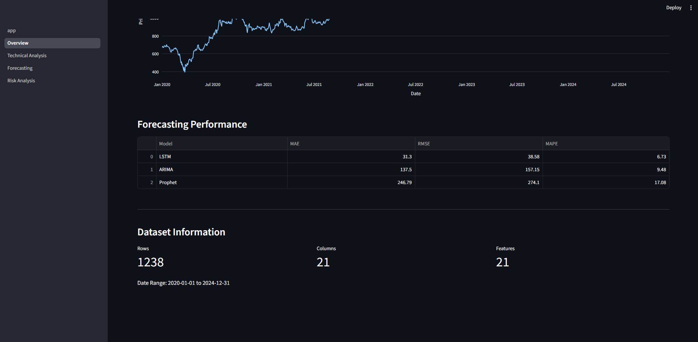
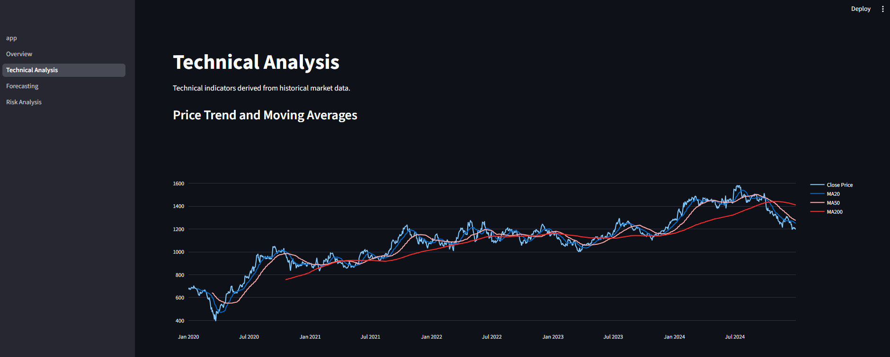
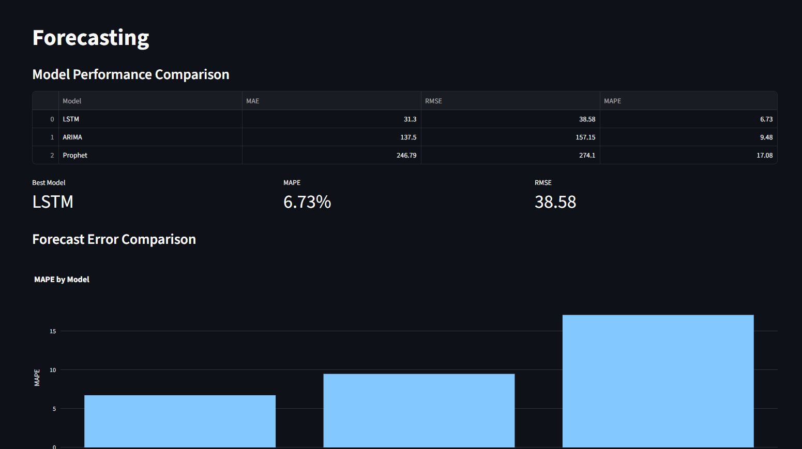
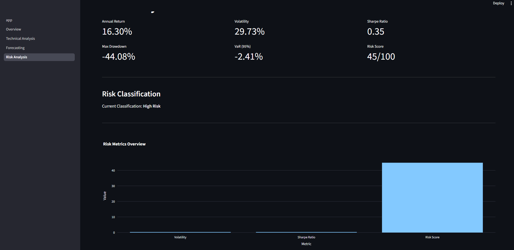
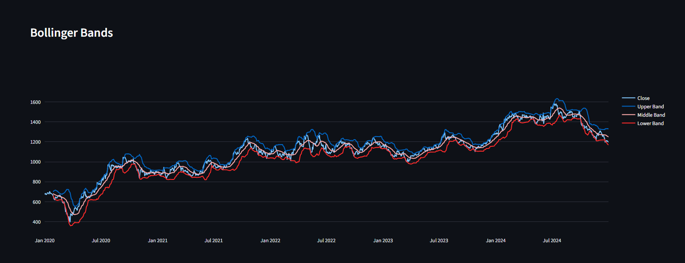
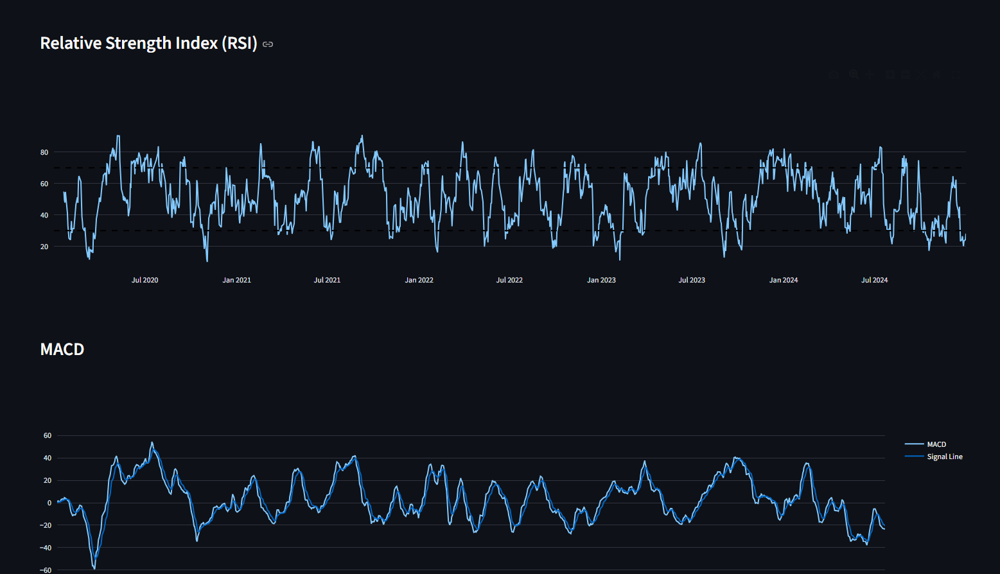
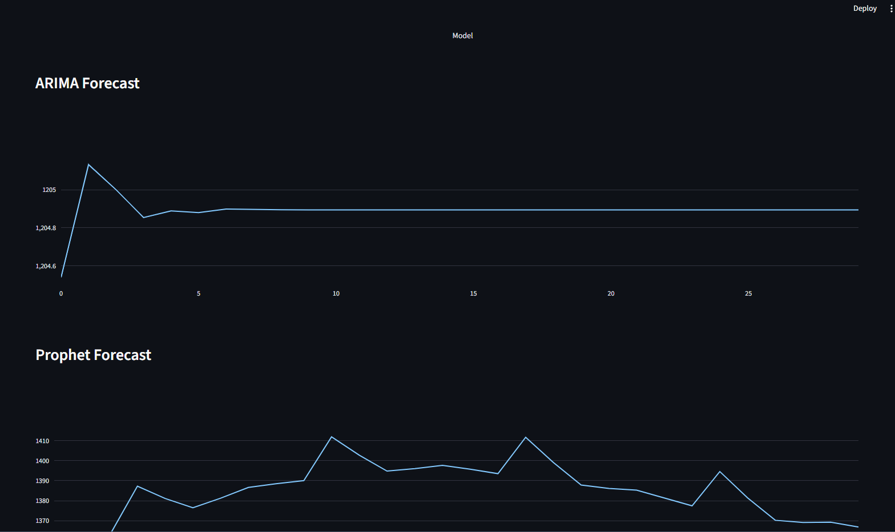
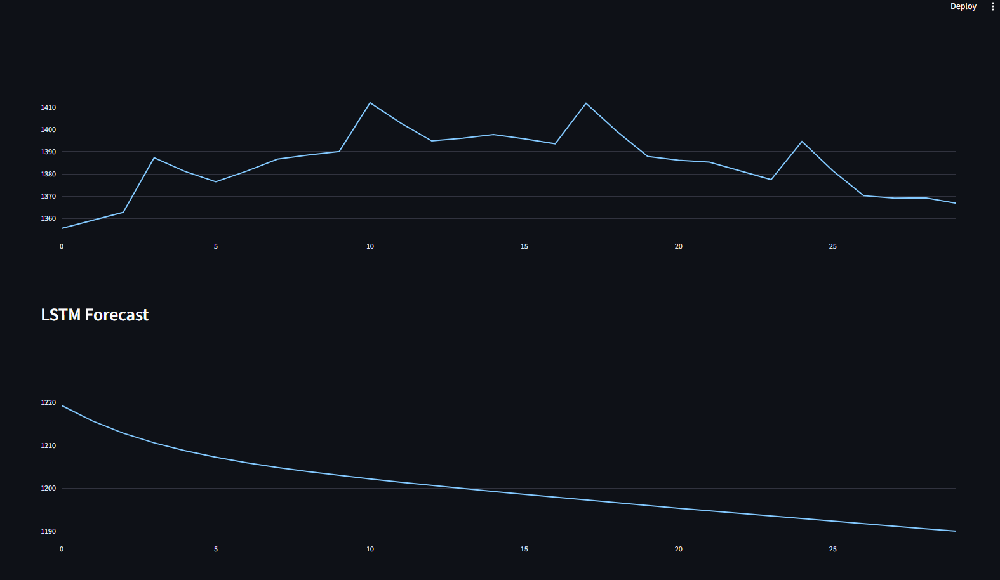
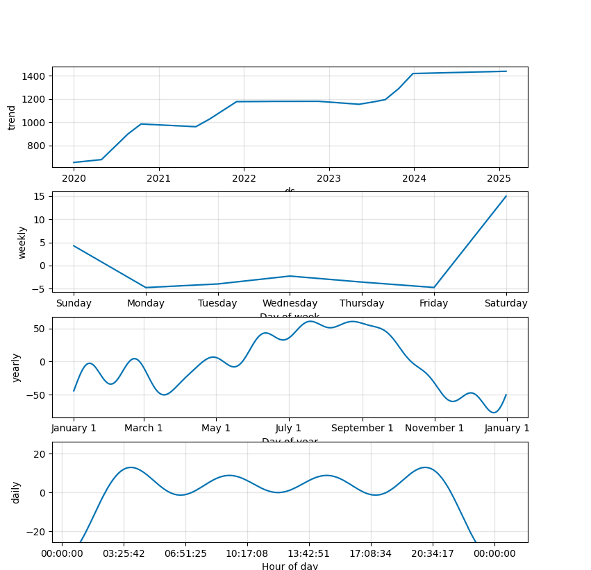

````markdown
# Stock Market Intelligence Platform

A stock market analysis and price forecasting platform built with Python, machine learning, deep learning, and Streamlit.

The project combines historical market data, technical indicators, risk analysis, and multiple forecasting models into a single analytical workflow and interactive dashboard.

---

## Overview

This project analyzes historical stock market data and uses different statistical and machine learning approaches to understand market trends and forecast future prices.

The workflow covers:

- Historical stock data collection
- Data validation and preprocessing
- Exploratory data analysis
- Technical indicator calculation
- Market trend analysis
- Risk measurement
- Time-series forecasting
- Model performance comparison
- Interactive Streamlit dashboard

Three forecasting approaches are implemented:

- ARIMA
- Prophet
- LSTM

The models are evaluated using MAE, RMSE, and MAPE to compare their forecasting performance.

---

## Key Features

### Data Pipeline

- Historical stock data collection using Yahoo Finance
- Data validation
- Missing-value handling
- Duplicate detection
- Data preprocessing
- Processed dataset generation

### Technical Analysis

The project calculates several commonly used technical indicators:

- Moving Average — MA20, MA50, MA200
- Relative Strength Index — RSI
- Moving Average Convergence Divergence — MACD
- Bollinger Bands
- Daily returns
- Rolling volatility

These indicators are used to analyze price movement and market behavior.

### Market Intelligence

The platform provides:

- Price trend analysis
- Trend scoring
- Market regime analysis
- Investment recommendation logic

### Risk Analysis

The project evaluates market risk using:

- Annualized return
- Annualized volatility
- Sharpe ratio
- Maximum drawdown
- Value at Risk (VaR)
- Risk score
- Risk classification

### Price Forecasting

Three forecasting models are implemented and compared:

| Model | Type |
|---|---|
| ARIMA | Statistical time-series model |
| Prophet | Time-series forecasting model |
| LSTM | Deep learning model |

Model performance is evaluated using:

- Mean Absolute Error (MAE)
- Root Mean Squared Error (RMSE)
- Mean Absolute Percentage Error (MAPE)

### Interactive Dashboard

A Streamlit dashboard provides separate sections for:

- Overview
- Technical Analysis
- Forecasting
- Risk Analysis

---

## Project Workflow

```text
Historical Stock Data
        ↓
Data Validation
        ↓
Data Preprocessing
        ↓
Exploratory Data Analysis
        ↓
Feature Engineering
        ↓
Technical Indicators
        ↓
┌───────────────┬────────────────┐
│               │                │
Risk Analysis   Market Analysis  Forecasting
                                 │
                    ┌────────────┼────────────┐
                    ↓            ↓            ↓
                  ARIMA        Prophet       LSTM
                    └────────────┼────────────┘
                                 ↓
                       Model Comparison
                                 ↓
                       Streamlit Dashboard
````

---

## Project Structure

```text
Stock-Market-Trend-Analysis-and-Price-Forecasting/
│
├── dashboard/
│   ├── app.py
│   └── pages/
│       ├── 1_Overview.py
│       ├── 2_Technical_Analysis.py
│       ├── 3_Forecasting.py
│       └── 4_Risk_Analysis.py
│
├── data/
│   ├── raw/
│   └── processed/
│
├── reports/
│   ├── model_comparison.csv
│   ├── risk_report.csv
│   ├── arima_forecast.csv
│   ├── prophet_forecast.csv
│   └── lstm_forecast.csv
│
├── screenshots/
│
├── src/
│   ├── data_fetch.py
│   ├── data_validator.py
│   ├── data_process.py
│   ├── feature_engineering.py
│   ├── eda_analysis.py
│   ├── risk_analysis.py
│   ├── arima_complete.py
│   ├── prophet_complete.py
│   └── lstm_forecast.py
│
├── .gitignore
├── LICENSE
├── requirements.txt
└── README.md
```

---

## Dashboard

The project includes an interactive Streamlit dashboard for exploring the analysis and forecasting results.

### Overview



### Technical Analysis



### Forecasting



### Risk Analysis



---

## Technical Analysis

### Bollinger Bands



### RSI and MACD



---

## Forecasting

### ARIMA and Prophet Forecasts



### ARIMA and LSTM Forecasts



### Prophet Components

The Prophet model also provides trend and seasonality components for understanding patterns in the historical data.



---

## Model Evaluation

The forecasting models are compared using three standard error metrics:

| Metric | Description                                      |
| ------ | ------------------------------------------------ |
| MAE    | Average absolute prediction error                |
| RMSE   | Penalizes larger prediction errors more strongly |
| MAPE   | Average percentage error                         |

The model comparison is available in:

```text
reports/model_comparison.csv
```

The best-performing model is selected based on forecasting error rather than assuming that one model will always perform better.

---

## Risk Analysis

The platform calculates several risk metrics to provide a broader view of market behavior:

| Metric                | Purpose                                                 |
| --------------------- | ------------------------------------------------------- |
| Annualized Return     | Measures yearly return                                  |
| Annualized Volatility | Measures price variability                              |
| Sharpe Ratio          | Measures return relative to risk                        |
| Maximum Drawdown      | Measures the largest peak-to-trough decline             |
| VaR                   | Estimates potential loss at a selected confidence level |
| Risk Score            | Provides a summarized risk measure                      |

The generated risk report is available in:

```text
reports/risk_report.csv
```

---

## Technologies Used

### Programming

* Python

### Data Processing

* Pandas
* NumPy

### Machine Learning

* Scikit-learn

### Deep Learning

* TensorFlow
* LSTM

### Time-Series Forecasting

* Statsmodels
* ARIMA
* Prophet

### Visualization

* Plotly
* Matplotlib

### Dashboard

* Streamlit

### Data Source

* Yahoo Finance

---

## Installation

Clone the repository and move into the project directory:

```bash
git clone <repository-url>
cd Stock-Market-Trend-Analysis-and-Price-Forecasting
```

Install the required dependencies:

```bash
pip install -r requirements.txt
```

---

## Running the Data Pipeline

Run the scripts in the following order:

```bash
python src/data_fetch.py
python src/data_validator.py
python src/data_process.py
python src/feature_engineering.py
python src/eda_analysis.py
python src/risk_analysis.py
```

Then run the forecasting models:

```bash
python src/arima_complete.py
python src/prophet_complete.py
python src/lstm_forecast.py
```

---

## Running the Dashboard

Start the Streamlit application:

```bash
streamlit run dashboard/app.py
```

The dashboard will open in your browser.

---

## Outputs

The project generates several outputs during the analysis pipeline:

```text
data/
    raw/
    processed/

reports/
    model_comparison.csv
    risk_report.csv
    arima_forecast.csv
    prophet_forecast.csv
    lstm_forecast.csv
```

These files contain processed data, risk metrics, forecasting results, and model comparison results.

---

## What This Project Demonstrates

This project brings together several areas of data science and machine learning into one end-to-end application:

* Data collection
* Data cleaning
* Exploratory data analysis
* Feature engineering
* Technical analysis
* Risk analytics
* Statistical forecasting
* Deep learning
* Model evaluation
* Data visualization
* Streamlit application development

Rather than focusing only on price prediction, the project combines **market analysis, forecasting, and risk evaluation** into a single platform.

---

## Future Improvements

Possible future extensions include:

* Multi-stock analysis
* Real-time market data
* Portfolio optimization
* News and sentiment analysis
* Transformer-based forecasting
* Cloud deployment
* Automated model retraining
* Portfolio-level risk analysis

---

## Disclaimer

This project is intended for educational and analytical purposes only.

The forecasts, risk metrics, and recommendations generated by the application should not be considered financial advice or a guarantee of future market performance.

---

## Author

**Dinesh Kumar**

B.Tech — Artificial Intelligence & Data Science

Apollo University

---

⭐ If you found this project useful, consider giving the repository a star.

```

### One important correction before you paste it

I **deliberately removed the hard-coded forecasting-performance numbers** from the README.

Your earlier README reported LSTM MAPE as **2.53%**, while the actual Streamlit Forecasting screenshot you showed me displays **6.73% MAPE and 38.58 RMSE**. So I don't want us putting a potentially incorrect result in a polished portfolio README. We'll verify `reports/model_comparison.csv` against the current dashboard before adding the final numbers.

This README is therefore **safe to paste now**, and then we'll do one final results verification.
```
